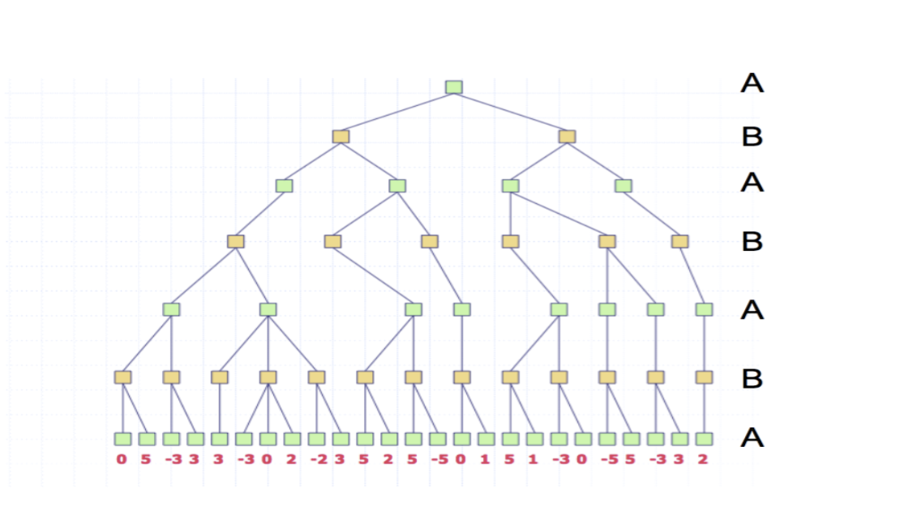
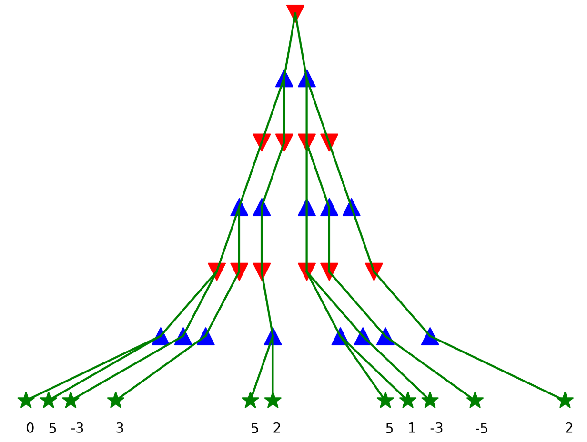
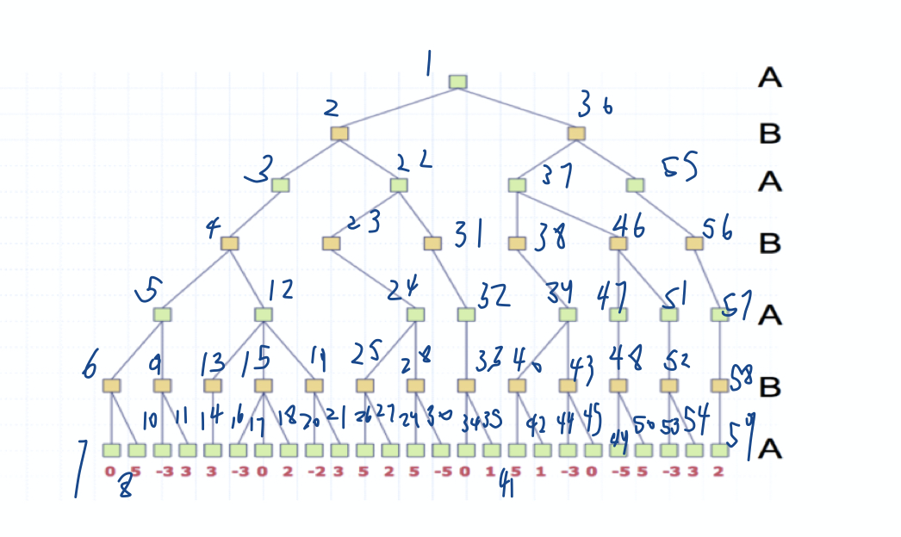
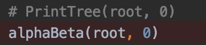

# AlphaBeta
阿尔法贝塔剪枝，可作图演示


一个简单的阿尔法贝塔剪枝演示程序：

可将如图



剪枝为




使用方法为（有点麻烦）：

程序按照DFS顺序依次询问每个节点，如下



若节点为非叶子节点，则询问其子节点


上图代表第一个节点有两个非叶子节点

若为叶子节点则询问其值

输入完毕即可开始剪枝，若单纯只想看多叉树可以调用



上面这个函数，并把下面剪枝函数注释掉


这里提供图中样例的输入（直接复制粘贴就可以使用了）

```
1 1
1 1
1
1 1
1 1
2 2
0
5
2 2
-3
3
1 1 1
2
3
2 2 2
-3
0
2
2 2
-2
3
1 1
1
1 1
2 2
5
2
2 2
5
-5
1
1
2 2
0 
1 
1 1
1 1
1 
1 1
2 2
5
1 
2 2
-3 
0 
1 1
1 
2 2 
-5 
5 
1 
2 2
-3 
3 
1 
1 
1 
2 
2
```

注意可能存在的空格或者换行错误